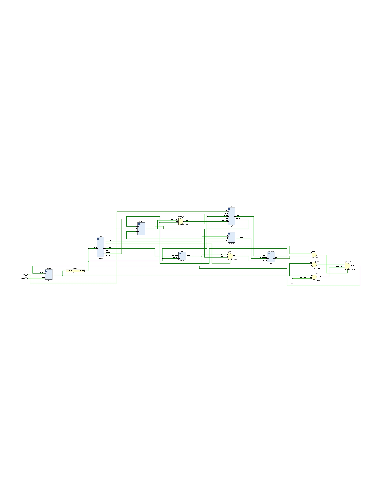
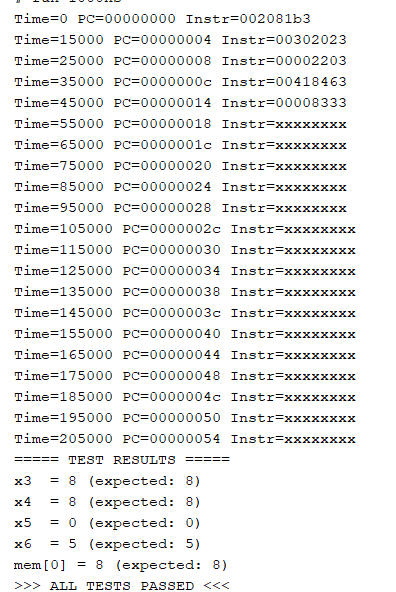
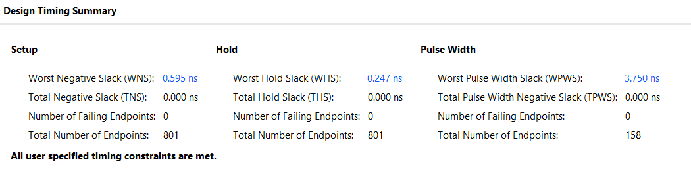

# RISC-V Single-Cycle Processor

A single-cycle RISC-V (RV32I subset) processor designed from scratch in Verilog, synthesized and verified on Xilinx Artix-7 FPGA.

## Overview

This processor executes one instruction per clock cycle, with the complete datapath — from instruction fetch through writeback — completing in a single clock period. The design was built module-by-module with a focus on understanding every signal and control path.

## Supported Instructions

| Instruction | Format | Opcode | Description |
|-------------|--------|--------|-------------|
| `add rd, rs1, rs2` | R-type | `0110011` | Register-register addition |
| `lw rd, imm(rs1)` | I-type | `0000011` | Load word from memory into register |
| `sw rs2, imm(rs1)` | S-type | `0100011` | Store word from register into memory |
| `beq rs1, rs2, offset` | B-type | `1100011` | Branch to PC+offset if rs1 == rs2 |

## Architecture



The processor consists of 9 modules connected through 3 multiplexers, 2 adders, and 1 AND gate:

### Modules

| Module | File | Type | Description |
|--------|------|------|-------------|
| Program Counter | `program_counter_32_bit.v` | Sequential | 32-bit register with synchronous reset, holds current instruction address |
| Instruction Memory | `imem.v` | Combinational | 64-word ROM, preloaded via `$readmemh`, word-aligned access using `addr[31:2]` |
| Control Unit | `control.v` | Combinational | Decodes `op[6:0]` into 7 control signals including `ImmSrc[1:0]` for sign extender format selection |
| ALU Decoder | `aludec.v` | Combinational | Maps `ALUOp` + `funct3` + `funct7[5]` to 3-bit ALU control code |
| Register File | `regfile.v` | Sequential write, Combinational read | 32 x 32-bit registers, 2 read ports, 1 write port, x0 hardwired to zero |
| Sign Extender | `signext.v` | Combinational | Decodes I-type, S-type, and B-type immediates based on `ImmSrc`, sign-extends to 32 bits |
| ALU | `alu.v` | Combinational | Supports ADD, SUB, AND, OR, SLT with 1-bit zero flag output |
| Data Memory | `datamem.v` | Sequential write, Combinational read | 64-word RAM, word-aligned access using `addr[31:2]` |
| Top Module | `top.v` | Structural | Instantiates all modules, contains muxes and PCNext logic |

### Control Signals

| Instruction | RegWrite | MemWrite | MemtoReg | ALUSrc | Branch | ALUOp | ImmSrc |
|-------------|----------|----------|----------|--------|--------|-------|--------|
| `add` | 1 | 0 | 0 | 0 | 0 | 10 | xx |
| `lw` | 1 | 0 | 1 | 1 | 0 | 00 | 00 |
| `sw` | 0 | 1 | 0 | 1 | 0 | 00 | 01 |
| `beq` | 0 | 0 | 0 | 0 | 1 | 01 | 10 |

### Datapath Flow

**`add rd, rs1, rs2`:** PC → imem fetches instruction → control sets ALUOp=10 → register file reads rs1 and rs2 → ALUSrc mux selects rs2 → ALU adds → MemtoReg mux selects ALU result → written back to rd

**`lw rd, imm(rs1)`:** PC → imem → control sets ALUSrc=1, MemtoReg=1 → register file reads rs1 → sign extender produces immediate → ALU computes rs1+imm (address) → data memory reads from address → MemtoReg mux selects memory data → written back to rd

**`sw rs2, imm(rs1)`:** PC → imem → control sets MemWrite=1, ALUSrc=1 → register file reads rs1 (base) and rs2 (data) → ALU computes rs1+imm (address) → data memory writes rs2 value at computed address

**`beq rs1, rs2, offset`:** PC → imem → control sets Branch=1, ALUOp=01 → register file reads rs1 and rs2 → ALU subtracts → if zero flag = 1, PCSrc = Branch AND Zero = 1 → PCNext mux selects PC+offset instead of PC+4

## Verification

Testbench (`tb_top.v`) executes a 6-instruction program that verifies all supported operations, including a taken branch that skips one instruction:

```
Address 0x00: add x3, x1, x2     # x3 = 5 + 3 = 8
Address 0x04: sw  x3, 0(x0)      # Store 8 to memory[0]
Address 0x08: lw  x4, 0(x0)      # Load from memory[0], x4 = 8
Address 0x0C: beq x3, x4, 8      # x3 == x4, branch to 0x14
Address 0x10: add x5, x1, x2     # SKIPPED (branch test)
Address 0x14: add x6, x1, x0     # x6 = 5 + 0 = 5
```

### Test Results

```
===== TEST RESULTS =====
x3  = 8  (expected: 8)   ✓ add verified
x4  = 8  (expected: 8)   ✓ lw verified
x5  = 0  (expected: 0)   ✓ beq skipped this instruction
x6  = 5  (expected: 5)   ✓ branch landed correctly
mem[0] = 8 (expected: 8) ✓ sw verified

>>> ALL TESTS PASSED <<<
```



## Static Timing Analysis

| Metric | Value |
|--------|-------|
| Target Clock | 100 MHz (10 ns period) |
| **fmax** | **106.3 MHz** |
| WNS (Setup) | +0.595 ns |
| WHS (Hold) | +0.247 ns |
| Failing Endpoints | 0 |

All user-specified timing constraints are met. The critical path traverses the full single-cycle datapath: PC → instruction memory → register file → ALU → data memory → writeback mux. This is the inherent bottleneck of a single-cycle architecture, which pipelining would address by splitting this path into stages.



## Project Structure

```
├── rtl/
│   ├── program_counter_32_bit.v
│   ├── imem.v
│   ├── control.v
│   ├── aludec.v
│   ├── regfile.v
│   ├── signext.v
│   ├── alu.v
│   ├── datamem.v
│   └── top.v
├── sim/
│   ├── tb_top.v
│   └── program.mem
├── diagrams/
│   ├── schematic.png
│   ├── test_results.png
│   └── timing_summary.png
└── README.md
```

## Tools

- **HDL:** Verilog
- **IDE:** Xilinx Vivado 2025.2
- **Target FPGA:** xc7a35tcpg236-1 (Artix-7)
- **Simulation:** Vivado XSim (behavioral)

## Future Work

- UART TX/RX module for serial communication
- 5-stage pipelined version with hazard detection and forwarding
- Extended instruction support (sub, and, or, slt, jal, jalr)
