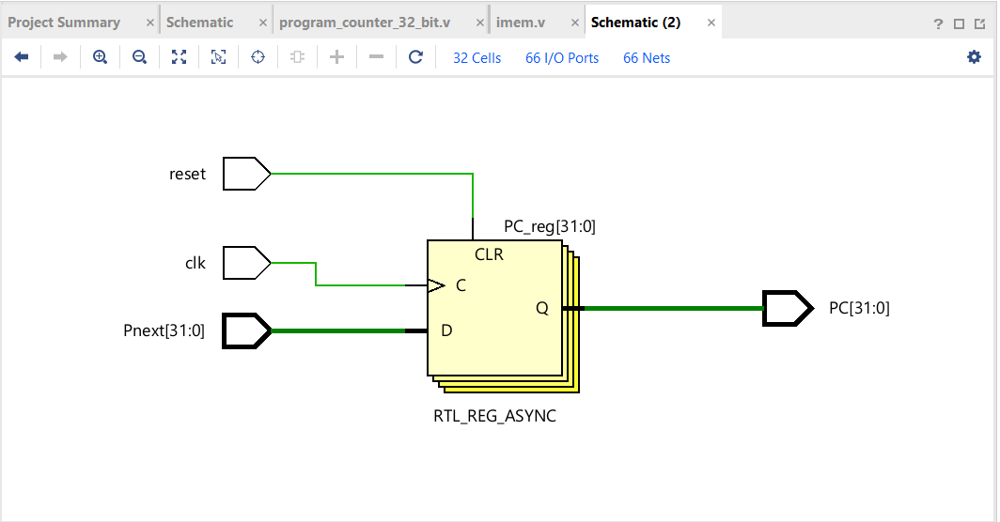

# RISC-V Single Cycle Processor (Work in Progress)

## Current Progress
- Program Counter (PC)
- Instruction Memory

## Modules

### Program Counter
- Holds current instruction address
- Updates every clock cycle

### Instruction Memory
- Stores instructions
- Outputs instruction based on PC

## RTL Schematics

### Program Counter

### Instruction Memory

## Tools
- Verilog
- Vivado
